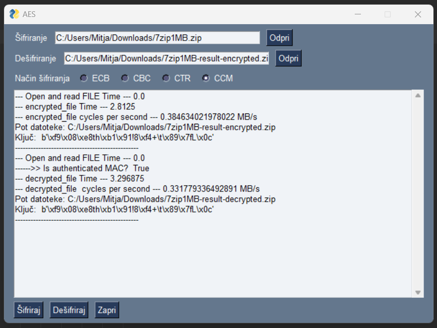

# AES - art of the ciphers

## Main idea

We prepared simple app in Python with GUI, where we demonstrate use of different modes of AES cipher.

We implement following cipher modes:

- ECB (Electronic codebook)
- CBC (Cipher Block Chaining)
- CTR (Counter)
- CCM (Counter with CBC-MAC)

## How It works

Our app have some basic GUI functionalities:

- opening the file we want to encrypt,
- opening the encrypted file we want to decrypt,
- select cipher mode for encrypt and decrypt.

Procedure of execution application when we select above options, start with following steps:

- On encrypting:
  1. We first generate secret key and IV (initialization vector) (e.g. both length of 12 bytes)
  2. Then we save secret key on hard drive
  3. Starts encryption process with selected cipher mode
  4. Encrypted result we save on hard drive in new file

- On decrypting:
  1. First find and open encrypted file
  2. Then we load secret key from hard drive for selected file
  3. Starts decryption process with same cipher mode
  4. Decrypted result we save on hard drive in new file

In both processes we also measure speed encryption/decryption in MB per second and time of execution.

